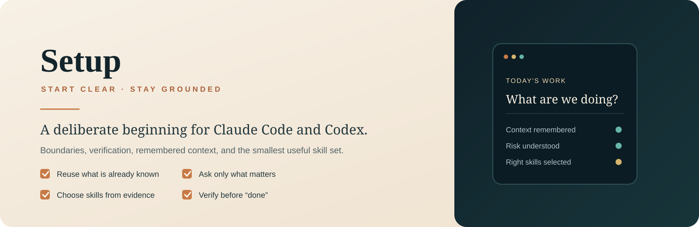

<p align="center">
  
</p>

# Setup

**A session-start skill for Claude Code and Codex that loads the context you need, chooses the smallest useful skill set, establishes working boundaries, and verifies before calling the work done.**

Setup is the quiet beginning of the Eidolon family. **Hearth** gets the system into place. **Setup** prepares the worktable. **Eidolon** does the deeper repository-aware reasoning and orchestration.

> **Prepare. Focus. Create. Belong.** Start with what is already known, ask only what matters, and leave irrelevant tools on the shelf.

## Quick start

For Codex:

```sh
mkdir -p ~/.agents/skills
git clone https://github.com/eidolonofficial/eidolon-setup.git ~/.agents/skills/setup
```

For Claude Code, install to `~/.claude/skills/setup`. For project-local use, choose `.agents/skills/setup` or `.claude/skills/setup` inside the project. On Windows PowerShell, use `$HOME` in place of `~` when needed.

For a backed-up replacement or a combined Eidolon + Setup installation, use **Hearth** rather than overwriting an existing destination manually.

Invoke `$setup` in Codex or `/setup` in Claude Code.

## What happens at the start of a session

| Step | Setup does | Setup does not |
| --- | --- | --- |
| **Recall** | Reuses relevant answers and project context that already exist. | Treat memory as unquestionable truth. |
| **Clarify** | Asks only for missing decisions that materially affect the work. | Repeat questions you already answered. |
| **Select** | Chooses skills from task, repository, risk, prerequisites, and explicit user choice. | Activate specialists because a generic token like `api`, `git`, or `python` appeared. |
| **Bound** | Establishes how far the agent should run, what requires approval, and what “go ahead” means. | Convert broad permission into unlimited authority. |
| **Verify** | Keeps observable done criteria and evidence in the closeout path. | Report success because the work merely looks plausible. |

## Intelligent skill selection

Setup deliberately prefers the **smallest sufficient, non-conflicting set** of installed skills. Explicit user selection wins when valid. Otherwise it uses narrow task triggers, inspected repository evidence, risk signals, description fit, exclusions, and prerequisites.

When the evidence does not justify a specialist, Setup returns a gap and works directly or uses the reviewed scout flow rather than guessing.

Skill selection is not the same thing as delegation. Simple sequential work should stay direct; subagents are reserved for parallel work, isolated context, specialist analysis, or independent verification.

## Shared workflow, honest host mappings

The preserved workflow lives in [`references/session-workflow.md`](references/session-workflow.md). Root and Codex skill files provide explicit host mappings before loading it, so Claude Code and Codex can share the same doctrine without pretending their transports are identical.

The shared `.claude/session.yaml` path remains for compatibility with existing Eidolon projects. That does **not** mean Codex inherits `.claude/settings.json` or Claude-specific hook behavior.

## Scope and limits

Setup is an instruction skill. Installing it does not automatically install a memory server, lifecycle hooks, an external security service, or a hidden automation layer. Eidolon's installer provides separate host wiring where supported.

Codex ask-tier operations remain conservative and require operator trust/manual review where native approval parity is unavailable.

## Verification

```sh
node --test tests/*.test.mjs
```

The tests cover packaging, workflow preservation, narrow skill selection, gap behavior, host semantics, and delegation restraint. They validate packaging and instruction contracts, **not live model behavior**. Use the evals in [`SKILL.md`](SKILL.md) before making an end-to-end claim.

## The family

- **Eidolon** — understands, selects, coordinates, verifies, and remembers.
- **Setup** — begins the session with the right context, boundaries, and tools.
- **Hearth** — installs everything through a review-first graphical experience.

## License

MIT. Created by Jonah Butterbaugh, alongside Claude. The original memory, verification, and pairing skills remain credited in the preserved workflow.